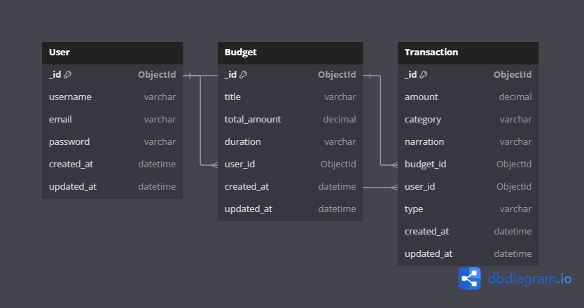

# Finance Manager

## Description

Finance Manager is a personal finance management application that allows users to effectively manage their finances. With features for secure authentication, financial data storage, and user-friendly APIs, this app is ideal for individuals seeking to organize their financial activities efficiently.

## Features

- **User Authentication:** Secure login and registration system.
- **Financial Data Management:** Easily store and track financial records.
- **API-Driven Architecture:** Fully functional RESTful API for seamless interaction.
- **Security:** Environment variables and hashed passwords for secure operations.

## Technologies Used

### Backend:
- **Node.js:** JavaScript runtime for building server-side applications.
- **Express.js:** Web framework for building APIs.
- **TypeScript:** Enhancing code quality and maintainability.
- **Mongoose:** Object Data Modeling (ODM) library for MongoDB.
- **JWT:** JSON Web Tokens for user authentication.

### Dev Tools:
- **Nodemon:** For hot reloading during development.
- **TypeScript Compiler (TSC):** To compile TypeScript to JavaScript.
- **ESLint:** Linting for maintaining code quality.

### Prerequisites:
- **Node.js**
- **MongoDB**
- **Vercel account (for deployment)**

## Installation and Setup

### Steps:

1. **Clone the Repository:** 
   git clone <repository-url>
   cd finance_manager

# Install Dependencies:

npm install

# Environment Variables:
Create a .env file in the root directory and add the following:

PORT=3000
MONGO_URI=<your-mongodb-connection-string>
JWT_SECRET=<your-jwt-secret>

# Start the Application:

Development Mode:

npm run dev

# Production Mode:

npm run build
npm start

# folder structure
finance_manager/
├── docs/                  # Holds project documentation, including the ERD diagram
│   └── erd-diagram.png    # Entity-Relationship Diagram
├── src/                   # Main application source code
│   ├── config/            # Database connection setup
│   ├── controllers/       # Logic for handling HTTP requests
│   ├── middlewares/       # Middleware functions for the application
│   ├── routes/            # Route definitions for different modules
│   ├── services/          # Business logic and reusable service functions
│   ├── utils/             # Utility/helper functions
│   ├── app.ts             # Express app setup
│   └── server.ts          # Server entry point
├── pg.js                  # Script to list and print names of files and directories in "src"
├── .env                   # Environment variables
├── package.json           # Project configuration
├── tsconfig.json          # TypeScript configuration
└── vercel.json            # Vercel deployment configuration

# Connecting to MongoDB
To connect your application to a MongoDB database, follow these steps:

- Install Dependencies: Ensure you have mongoose installed, which is an ODM (Object Data Modeling) library for MongoDB and Node.js. You can install it using npm:
- npm install mongoose
-  Create a .env file in the root of your project to store your database connection string securely . 
 - Create a folder called config and include a db.ts file in it
 - create a function to connect your database using mongoose.connect to access your MONGO_URI from your env file using process.env.MONGO-URI
 - export the function and call the function in your server.js where all server connections occur.
 - npm run dev to start the server  
  
  # Link to postman collection
  https://documenter.getpostman.com/view/35173606/2sAYJ1m3KM

  ## Entity-Relationship Diagram (ERD)
   Below is the ERD representing the relationships between Users, Budgets, Transactions, Goals, and Categories:

  

# Test the Application:
Use Postman or any REST client to test the API endpoints.

# Author

Idoga Daniel